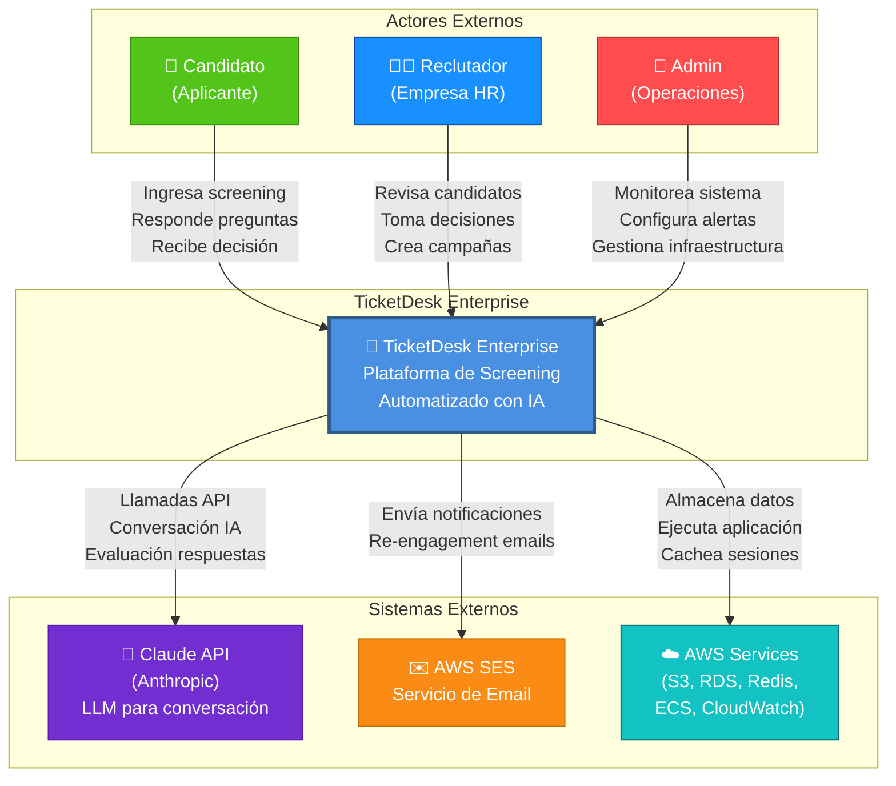
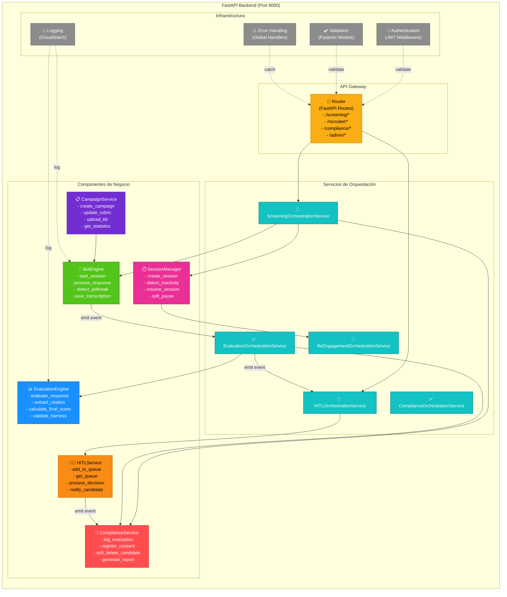
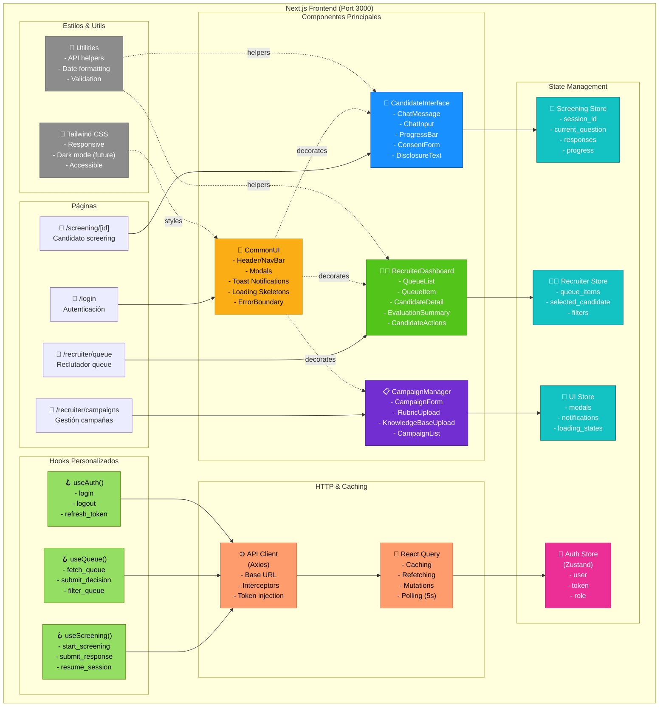

# Diagrama C4 — TicketDesk Enterprise v1.0

**C4 Model: Context (Level 1) y Containers (Level 2)**  
**Fecha**: 2026-05-27  
**Formato**: Mermaid.js

---

## C4 NIVEL 1: CONTEXTO DEL SISTEMA

Muestra TicketDesk Enterprise en relación con actores externos y sistemas.



**Descripción**:
- **Candidato**: Accede a screening (web), responde preguntas, recibe decisión vía email
- **Reclutador**: Utiliza dashboard para ver cola HITL, revisar evaluaciones, tomar decisiones
- **Admin**: Monitorea sistema, configura alertas, gestiona infraestructura AWS
- **Claude API**: LLM externa para conversación adaptativa del screening
- **AWS SES**: Servicio de email para notificaciones y re-engagement
- **AWS Services**: Infraestructura: S3, RDS (PostgreSQL), Redis, ECS, CloudWatch

---

## C4 NIVEL 2: CONTENEDORES

Muestra componentes principales dentro de TicketDesk Enterprise y cómo se comunican.

```mermaid
graph TB
    subgraph "Clientes"
        WebBrowser["🌐 Web Browser<br/>(Candidato)")
        RecruiterBrowser["🌐 Web Browser<br/>(Reclutador)"]
    end

    subgraph "Tier 1: Presentación (CDN + Load Balancing)"
        ALB["⚙️ AWS ALB<br/>(Application Load Balancer)<br/>Port 443 HTTPS<br/>Health Checks"]
    end

    subgraph "Tier 2: Aplicación"
        Frontend["📱 Frontend Container<br/>(Next.js 14)<br/>React + Zustand<br/>Port 3000<br/>- CandidateInterface<br/>- RecruiterDashboard<br/>- CampaignManager<br/>- CommonUI"]
        
        Backend["🔧 Backend Container<br/>(FastAPI + Python)<br/>Port 8000<br/>- BotEngine<br/>- EvaluationEngine<br/>- HITLService<br/>- ComplianceService<br/>- CampaignService<br/>- SessionManager"]
    end

    subgraph "Tier 3: Servicios & Orquestación"
        EventBus["📢 Event Bus<br/>(Redis Pub/Sub)<br/>Async Events:<br/>- response.submitted<br/>- evaluation.complete<br/>- decision.made"]
        
        TaskQueue["⏳ Task Queue<br/>(Celery + Redis)<br/>Background Jobs:<br/>- evaluate_response<br/>- send_email<br/>- detect_abandoned<br/>- cleanup_data"]
    end

    subgraph "Tier 4: Data Persistence"
        PostgreSQL["🗄️ PostgreSQL RDS<br/>(Multi-AZ)<br/>- candidates<br/>- sessions<br/>- responses<br/>- evaluations<br/>- decisions<br/>- audit_logs<br/>- consent_records"]
        
        Redis["💾 Redis Cache<br/>(ElastiCache)<br/>- session:{id}<br/>- rubric:{id}<br/>- queue:pending<br/>- reengagement:scheduled"]
        
        S3["📦 S3 Buckets<br/>- transcriptions/<br/>- knowledge-base/<br/>- compliance-reports/<br/>- redis-backups/"]
    end

    subgraph "Tier 5: Integración Externa"
        ClaudeAPI["🤖 Claude API<br/>(Anthropic)<br/>- generate_question<br/>- evaluate_response"]
        
        EmailService["✉️ Email Service<br/>(AWS SES)<br/>- send_notification<br/>- send_reengagement"]
        
        Monitoring["📊 CloudWatch<br/>(Monitoring & Logging)<br/>- Metrics<br/>- Logs<br/>- Alarms"]
    end

    %% Comunicación Frontend
    WebBrowser -->|HTTPS| ALB
    RecruiterBrowser -->|HTTPS| ALB
    ALB -->|HTTP 3000| Frontend
    ALB -->|HTTP 8000| Backend

    %% Frontend ↔ Backend
    Frontend -->|REST API| Backend
    Backend -->|HTTP 200 JSON| Frontend

    %% Backend ↔ Data Layer
    Backend -->|SQL Queries<br/>ACID Transactions| PostgreSQL
    Backend -->|GET/SET<br/>Pub/Sub| Redis
    Backend -->|PUT/GET<br/>Objects| S3

    %% Backend → Event Bus & Task Queue
    Backend -->|emit event| EventBus
    EventBus -->|subscribe| TaskQueue
    TaskQueue -->|async process| Backend

    %% Backend → External APIs
    Backend -->|POST /messages<br/>Claude API Calls| ClaudeAPI
    Backend -->|send_email()| EmailService
    Backend -->|CloudWatch API| Monitoring

    %% Inter-Container Communication
    EventBus ↔️|pub/sub| Redis
    TaskQueue ↔️|enqueue/dequeue| Redis

    %% Styling
    style ALB fill:#FF9C6E,stroke:#D66236,color:#000,stroke-width:2px
    style Frontend fill:#1890FF,stroke:#0D47A1,color:#fff,stroke-width:2px
    style Backend fill:#52C41A,stroke:#3A8A13,color:#fff,stroke-width:2px
    style EventBus fill:#FA8C16,stroke:#B56C00,color:#000,stroke-width:2px
    style TaskQueue fill:#FA8C16,stroke:#B56C00,color:#000,stroke-width:2px
    style PostgreSQL fill:#13C2C2,stroke:#0B6B6B,color:#fff,stroke-width:2px
    style Redis fill:#EB2F96,stroke:#991A5E,color:#fff,stroke-width:2px
    style S3 fill:#722ED1,stroke:#531BAC,color:#fff,stroke-width:2px
    style ClaudeAPI fill:#9254DE,stroke:#6C3DB0,color:#fff,stroke-width:2px
    style EmailService fill:#FF85C0,stroke:#C41340,color:#fff,stroke-width:2px
    style Monitoring fill:#FAAD14,stroke:#B88600,color:#000,stroke-width:2px
    style WebBrowser fill:#BFBFBF,stroke:#595959,color:#000
    style RecruiterBrowser fill:#BFBFBF,stroke:#595959,color:#000
```

**Descripción de Contenedores**:

### Tier 1: Load Balancing
- **ALB (Application Load Balancer)**: Distribuye tráfico HTTPS (443) a frontend y backend

### Tier 2: Aplicación
- **Frontend (Next.js)**:
  - React 18 con TypeScript
  - State: Zustand
  - Componentes: CandidateInterface (chat), RecruiterDashboard (queue), CampaignManager
  
- **Backend (FastAPI)**:
  - 6 componentes principales
  - REST API endpoints
  - Integración con Claude API, servicios externos

### Tier 3: Orquestación
- **Event Bus (Redis Pub/Sub)**: Comunicación asincrónica entre servicios
- **Task Queue (Celery)**: Procesos background (evaluaciones, emails, limpieza)

### Tier 4: Persistencia
- **PostgreSQL RDS**: BD relacional principal (tablas: candidates, sessions, evaluations, decisions, audit_logs)
- **Redis ElastiCache**: Caché en-memory (sesiones, rúbricas, cola HITL)
- **S3 Buckets**: Almacenamiento objetos (transcripciones, KB, reportes, backups)

### Tier 5: Integraciones
- **Claude API**: LLM para conversación y evaluación
- **Email Service (SES)**: Notificaciones y re-engagement
- **CloudWatch**: Monitoreo, logging, alarmas

---

## C4 NIVEL 2 DETALLADO: COMPONENTES BACKEND

Zoom in en Backend container mostrando los 6 componentes principales:



---

## C4 NIVEL 2 DETALLADO: COMPONENTES FRONTEND

Zoom in en Frontend container mostrando componentes principales:



---

## LEYENDA

### Colores por Tipo
- 🔵 **Azul**: Componentes Frontend / APIs HTTP
- 🟢 **Verde**: Componentes Backend / Lógica
- 🟠 **Naranja**: Servicios Externos / APIs
- 🟣 **Púrpura**: Integraciones / APIs
- 🟤 **Gris**: Infraestructura / Utilities
- 🔴 **Rojo**: Seguridad / Compliance

### Patrones de Comunicación
- **→** (Flecha sólida): Comunicación sincrónica / HTTP
- **→** (Flecha punteada): Inyección de dependencias / decoración
- **↔️** (Doble flecha): Pub/Sub o bidireccional

---

## FLUJOS DE DATOS CLAVE

### Flujo 1: Screening Candidato
```
WebBrowser → ALB → Frontend (Chat UI)
          ↓
Frontend → Backend (/api/screening/start)
          ↓
Backend → BotEngine → Claude API
        → SessionManager → Redis
        → ComplianceService → PostgreSQL (audit)
          ↓
Backend → Frontend (first_question)
          ↓
Candidato responde
          ↓
Frontend → Backend (/api/screening/{id}/response)
          ↓
Backend → EventBus (emit: candidate.response.submitted)
          ↓
EvaluationEngine (async) → EvaluationService → PostgreSQL
          ↓
EventBus (emit: evaluation.complete)
          ↓
HITLOrchestration → check score
  ├─ If 50-80: add_to_queue → Redis, notify recruiter
  ├─ If >80: auto_approve → notify candidate
  └─ If <50: auto_reject → notify candidate
```

### Flujo 2: Decisión Reclutador
```
RecruiterBrowser → ALB → Frontend (RecruiterDashboard)
                 ↓
Frontend (polling) → Backend (/api/recruiter/queue)
                   ↓
Backend → Redis (queue:pending) → Frontend (QueueList)
                   ↓
Reclutador selecciona candidato
                   ↓
Frontend → Backend (/api/recruiter/candidate/{id})
         ↓
Backend → PostgreSQL (fetch evaluations + citations)
        → Frontend (CandidateDetail)
                   ↓
Reclutador clicks "Aprobar" / "Rechazar"
                   ↓
Frontend → Backend (POST /api/recruiter/decision)
         ↓
Backend → HITLService (process_decision)
        → PostgreSQL (save decision)
        → EventBus (emit: recruiter.decision.made)
          ├─ ComplianceService → audit_logs
          └─ EmailService → send notification
        → Frontend (update queue, remove item)
```

### Flujo 3: Re-engagement (Background Job)
```
Celery Worker (every 1 min) → detect_abandoned_sessions
                           ↓
Check Redis: session:{id} last_activity
                           ↓
If >5 min inactivo:
  ├─ emit: session.abandoned
  ├─ Schedule: send_reengagement_24h (Celery task)
  └─ Schedule: send_reengagement_48h (Celery task)
                           ↓
24 horas después:
  ├─ Task executes
  ├─ Load candidate + session
  ├─ Render email template
  └─ Send via EmailService (SES)
                           ↓
Candidato clica resume link
  ├─ Frontend: resume_session endpoint
  ├─ Backend: restore context
  └─ Cancel pending re-engagement tasks (Celery.revoke)
```

---

## PERSPECTIVA TÉCNICA: COMUNICACIÓN ENTRE CONTENEDORES

| Origen | Destino | Protocolo | Tipo | Ejemplo |
|--------|---------|-----------|------|---------|
| Frontend | Backend | HTTPS/REST | Sincrónico | POST /api/screening/{id}/response |
| Backend | Claude API | HTTPS | Sincrónico | /v1/messages (Claude SDK) |
| Backend | PostgreSQL | TCP:5432 | Sincrónico | SELECT * FROM evaluations |
| Backend | Redis | TCP:6379 | Sincrónico + Async | PUBLISH, GET, SET |
| Backend | S3 | HTTPS | Sincrónico | PutObject, GetObject |
| Backend | Email Service | SMTP:587 | Asincrónico | SendEmail (Celery) |
| Backend | CloudWatch | HTTPS | Asincrónico | PutMetricData, PutLogEvents |
| Celery Worker | Redis | TCP:6379 | Sincrónico | Dequeue tasks, pub/sub |
| Frontend | HTTP Cache | Memory | Sincrónico | React Query (in-memory) |

---

**Generado**: 2026-05-27  
**Formato**: Mermaid.js (compatible con GitHub, GitLab, Notion, Confluence)  
**Nivel de Detalle**: C4 Models (Context + Containers)

