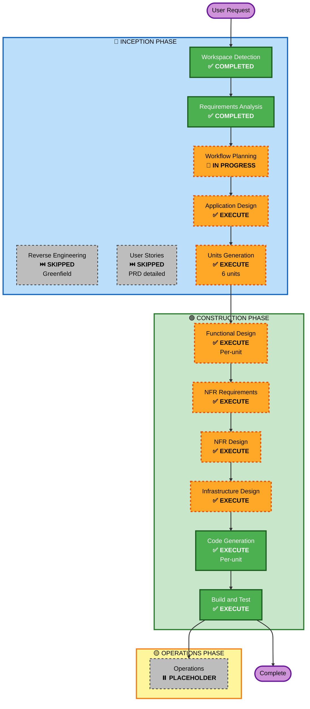

# Plan de Ejecución — TicketDesk Enterprise v1.0

**Documento generado mediante AI-DLC Workflow Planning**  
**Fecha**: 2026-05-27  
**Estado**: Aprobado — Listo para Construcción

---

## ANÁLISIS DETALLADO DE SCOPE

### Tipo de Proyecto
- **Clasificación**: Greenfield (sin código existente)
- **Complejidad**: Moderada-Alta
- **Criterios**:
  - ✅ Nuevos componentes/servicios (6 módulos principales)
  - ✅ APIs nuevas (RESTful backend)
  - ✅ Lógica compleja (evaluación, auditoría, re-engagement)
  - ✅ Requisitos NFR críticos (LGPD, 99.5% uptime, seguridad)
  - ✅ Infraestructura nueva (AWS, ECS, RDS, Redis)

### Evaluación de Impacto

| Área | Cambio | Impacto |
|---|---|---|
| **User-facing** | Interfaz web candidato + dashboard reclutador | Alto — 2 aplicaciones frontend |
| **Structural** | 6 módulos backend, arquitectura monolítica modular | Alto — estructura nueva |
| **Data Model** | Campaign, Candidate, Screening, Evaluation, AuditLog | Alto — nuevas entidades |
| **API** | 40+ endpoints REST (bot, HITL, compliance, campaigns) | Alto — API nueva completa |
| **NFR** | LGPD, 99.5% uptime, 80%+ test coverage, cero hallucinations | Crítico — pilares producto |

### Evaluación de Riesgo
- **Nivel**: **ALTO**
  - Dependencia crítica Claude API (LLM provider)
  - Cumplimiento LGPD Brasil (regulatorio)
  - Evaluación legal (citas textuales exactas)
  - Performance <2s (usuarios intolerantes latencia)
  
- **Complejidad Rollback**: Moderada (MVP, fácil revertir)
- **Complejidad Testing**: Alta (65 casos red-teaming + 80%+ coverage)

---

## DETERMINACIÓN DE FASES

### INCEPTION PHASE

#### ✅ Workspace Detection
- **Estado**: COMPLETADO
- Proyecto greenfield confirmado

#### ⏭️ Reverse Engineering
- **Estado**: SKIPPED
- **Razón**: Proyecto greenfield, sin código existente

#### ✅ Requirements Analysis
- **Estado**: COMPLETADO
- Requisitos técnicos documentados, stack tech aprobado

#### ⏭️ User Stories
- **Estado**: SKIPPED
- **Razón**: PRD ya incluye 5 casos de uso detallados + 4 journeys. Suficiente para construcción.

#### 🔄 Workflow Planning
- **Estado**: IN PROGRESS (Este documento)
- Creando plan de ejecución

#### ✅ Application Design — EXECUTE
- **Razón**: 
  - 6 módulos nuevos requeridos (bot, evaluación, HITL, compliance, campaigns, lifecycle)
  - Nuevas entidades de datos (Campaign, Candidate, Screening, Evaluation, AuditLog)
  - Servicios internos complejos (motor evaluación, guardrails, re-engagement)
  - Component dependencies necesitan claridad pre-desarrollo

#### ✅ Units Generation — EXECUTE
- **Razón**:
  - Arquitectura modular monolítica → múltiples unidades de trabajo independientes
  - 8-10 semanas dev requiere paralelización (4-6 devs)
  - Nuevas APIs, data models, microservicios futuros (v1.1)
  - Units permitirá desarrollo paralelo sin bloqueos

---

### CONSTRUCTION PHASE

#### ✅ Functional Design — EXECUTE
- **Razón**: 
  - Lógica de screening conversacional (seguimientos adaptativos, guardrails)
  - Lógica de evaluación (rúbricas, cálculo scores, citas textuales)
  - Flujos abandonment/re-engagement complejos
  - HITL revisión con validaciones

#### ✅ NFR Requirements — EXECUTE
- **Razón**:
  - Seguridad crítica (LGPD, jailbreak prevention, auditoría)
  - Performance crítico (<2s bot, 100+ concurrentes)
  - Compliance LGPD con fecha límite producto
  - Escalabilidad roadmap (v1.1 microservicios)

#### ✅ NFR Design — EXECUTE
- **Razón**:
  - Patterns seguridad (encryption, auth, rate-limiting, jailbreak detection)
  - Patterns performance (caching rúbricas, sesión Redis, polling optimization)
  - Patterns LGPD (borrado suave, auditoría inmutable, consentimiento)
  - Patterns escalabilidad (horizontal scaling, data partitioning)

#### ✅ Infrastructure Design — EXECUTE
- **Razón**:
  - AWS setup complejo (RDS, ElastiCache, ECS, ALB, S3, KMS)
  - LGPD residencia datos Brasil (São Paulo region)
  - Disaster recovery (multi-AZ, backup strategy)
  - CI/CD (GitHub Actions → ECR → ECS)
  - Monitoring (CloudWatch, logs JSON, alerting)

#### ✅ Code Generation — EXECUTE (ALWAYS)
- **Razonamiento**: Implementación completa requerida

#### ✅ Build & Test — EXECUTE (ALWAYS)
- **Razonamiento**: Build, testing, validation requerido

---

### OPERATIONS PHASE
- **Estado**: PLACEHOLDER (post-MVP)

---

## DESCOMPOSICIÓN EN UNITS OF WORK

Basado en arquitectura modular, el proyecto se descompone en **6 Units principales** para desarrollo paralelo (3-4 Units simultáneamente):

### Unit 1: Infra & Setup
**Responsable**: 1 DevOps/Backend sénior  
**Duración**: Semanas 1-2 (crítica, bloquea otros)  
**Entregables**:
- ✅ AWS setup (RDS, ElastiCache, S3, KMS, VPC)
- ✅ Docker & ECS configuration
- ✅ CI/CD pipeline (GitHub Actions)
- ✅ Monitoring & logging (CloudWatch, JSON logs)
- ✅ Base project structure (FastAPI + Next.js repos)

**Dependencias**: Ninguna (crítica path)  
**Bloquea**: Unit 2-6

---

### Unit 2: Backend Fundamentals & APIs
**Responsable**: 1-2 Backend Python sénior  
**Duración**: Semanas 2-4  
**Entregables**:
- ✅ FastAPI project setup (Pydantic models, DB models)
- ✅ Database schema (Campaign, Candidate, Screening, Evaluation, AuditLog)
- ✅ Auth system (JWT, OAuth2)
- ✅ Core APIs: Campaign management, Candidate CRUD
- ✅ Base logging & error handling
- ✅ 80% test coverage (unit + integration)

**Dependencias**: Unit 1  
**Bloquea**: Unit 3, 4, 5

---

### Unit 3: Bot Screening Engine
**Responsable**: 1 Backend Python (IA/LLM experience)  
**Duración**: Semanas 3-5  
**Entregables**:
- ✅ Claude API integration (prompt engineering, streaming)
- ✅ Conversational flow (5-6 questions, follow-ups)
- ✅ Guardrails & escalation logic
- ✅ Jailbreak detection & prevention
- ✅ Session management (Redis)
- ✅ Transcription capture (S3)
- ✅ Integration tests (65 red-teaming cases)
- ✅ 80%+ test coverage

**Dependencias**: Unit 1, Unit 2  
**Bloquea**: Unit 5 (partial), Unit 6

---

### Unit 4: Evaluation Engine & HITL
**Responsable**: 1 Backend Python  
**Duración**: Semanas 3-5  
**Entregables**:
- ✅ Rúbrica configurable (scoring engine, competence mapping)
- ✅ Evaluación tiempo real (scoring algoritmo)
- ✅ Cita textual extraction (exact matching, verbatim)
- ✅ HITL dashboard backend APIs
- ✅ Cola review filtering & sorting
- ✅ Decisión registrarse con audit trail
- ✅ 80%+ test coverage

**Dependencias**: Unit 1, Unit 2  
**Bloquea**: Unit 5 (partial), Unit 6

---

### Unit 5: Frontend (Web Candidate + Dashboard HITL)
**Responsable**: 1 Fullstack Frontend (Next.js)  
**Duración**: Semanas 3-5  
**Entregables**:
- ✅ Candidate interface:
  - Divulgación IA + consentimiento LGPD
  - Chat bot conversacional (real-time)
  - Progress indicator, pausa, re-engagement flow
  - Feedback post-screening
  
- ✅ Recruiter dashboard:
  - Cola HITL filtrada
  - Panel decisión (resumen + citas + transcripción)
  - Acciones (Aprobar/Rechazar)
  - Analytics campaña básico

- ✅ i18n framework (español + estructura para português v1.2)
- ✅ Responsive design (mobile + desktop)
- ✅ Accesibilidad (WCAG 2.1 AA basic)
- ✅ E2E tests (Playwright, 20+ casos)

**Dependencias**: Unit 1, Unit 2, Unit 3, Unit 4 (APIs)  

---

### Unit 6: Compliance, Abandonment & Re-engagement
**Responsable**: 1 Backend Python  
**Duración**: Semanas 4-5  
**Entregables**:
- ✅ Auditoría inmutable (append-only logs, no overwrites)
- ✅ Registro consentimiento LGPD (timestamps, versiones)
- ✅ Borrado suave & hard-delete automático (90 días)
- ✅ Abandonment detection (5 min inactividad)
- ✅ Re-engagement automático (24h, 48h emails)
- ✅ Session recovery (contexto exacto)
- ✅ Reportes compliance (PDF, auditoría)
- ✅ NPS survey & analytics
- ✅ 80%+ test coverage

**Dependencias**: Unit 1, Unit 2, Unit 3, Unit 4  

---

## CRONOGRAMA DE DESARROLLO

```
Semana 1-2:  Unit 1 (Infra)
             ↓
Semana 2-4:  Unit 2 (Backend Fundamentals) — bloqueador, crítica
             ↓
Semana 3-5:  Unit 3 (Bot Engine)
             Unit 4 (Evaluation)
             Unit 5 (Frontend)  — paralelo con Unit 3,4
             ↓
Semana 4-5:  Unit 6 (Compliance)  — paralelo con Unit 3,4,5
             ↓
Semana 5:    Integration & E2E testing
Semana 6:    Performance tuning, security scanning
Semana 7:    Bug fixes, polish, legal review
Semana 8:    Staging validation, pilot preparation
Semana 9-10: MVP production-ready

Critical Path: Unit 1 → Unit 2 → Unit 3 (o Unit 4) → Unit 6
Total: 10 semanas (target 8-10 PRD)
```

---

## VISUALIZACIÓN DE FLUJO AI-DLC



**Leyenda**:
- ✅ COMPLETED: Fase completada
- ⏭️ SKIPPED: Fase omitida (razón documentada)
- 🔄 IN PROGRESS: Fase actual
- ✅ EXECUTE: Fase para ejecutar (condicional)
- ⏸️ PLACEHOLDER: Fase futura (post-MVP)

---

## CRITERIOS DE ÉXITO

### Criterios Funcionales
- ✅ Todos 11 Must-Have features implementados
- ✅ 5-6 preguntas screening completadas <18 min
- ✅ 100% citas textuales para evaluaciones
- ✅ Tasa completitud ≥85%

### Criterios Cumplimiento
- ✅ Auditoría LGPD sin hallazgos críticos
- ✅ Consentimiento 100% candidatos
- ✅ Transparencia IA explícita
- ✅ DPA firmado disponible

### Criterios Calidad
- ✅ Test coverage 80%+
- ✅ Factualidad IA ≥98% (red-teaming)
- ✅ Zero critical security vulnerabilities
- ✅ Uptime 99.5% staging

### Criterios Performance
- ✅ Bot latency <2s p95
- ✅ HITL dashboard <3s
- ✅ 100+ candidatos concurrentes

---

## PRÓXIMOS PASOS

1. ✅ Workflow Planning — **COMPLETE**
2. → **Application Design** — Comenzar semana próxima
3. → **Units Generation** — Descomposición detallada units
4. → **Functional Design** — Diseño por unit
5. → **Code Generation** — Implementación

---

**Estado**: ✅ Plan de Ejecución Aprobado  
**Equipos**: 4-6 desarrolladores (1 DevOps, 2 Backend, 1 Frontend, 1-2 QA)  
**Timeline**: 8-10 semanas → MVP producción-listo  
**Go/No-Go**: Día 30 (sandbox), Día 60 (piloto), Día 90 (GA)
